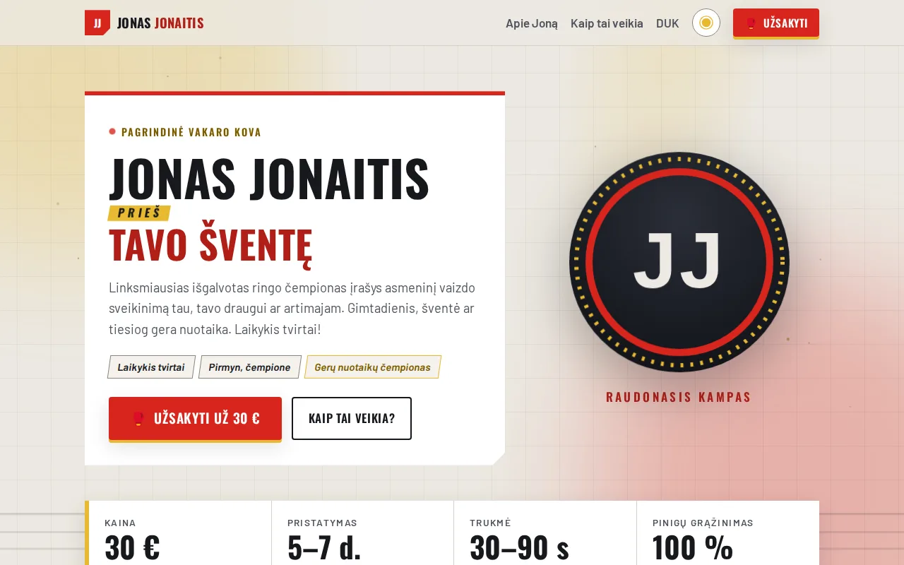
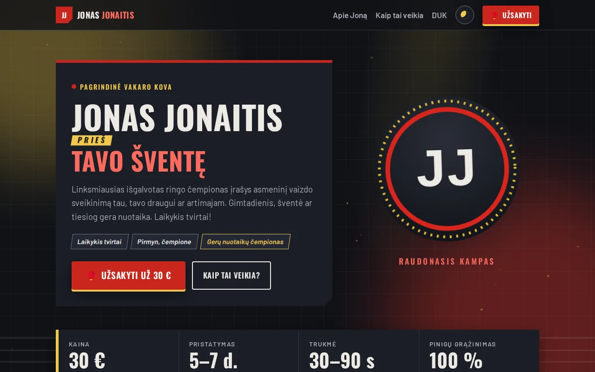
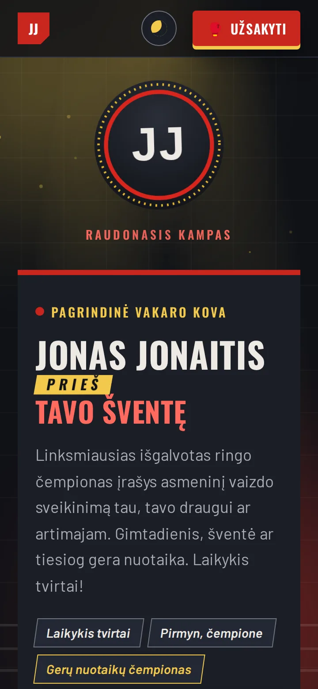

# 🥊 Petras Dovydaitis — vaizdo sveikinimai

Vieno puslapio svetainė, kurioje galima užsisakyti asmeninį Petro Dovydaičio vaizdo sveikinimą už 30 €. Ji sukurta kaip kovos vakaro plakatas su gyvu „ringo prožektorių“ fonu.

**[▶ Gyva demo versija](https://brutall100.github.io/petras-dovydaitis/)** · **[Kodas](https://github.com/brutall100/petras-dovydaitis)**



<p>
  
  
</p>

## Apie projektą

Petras yra vienas spalvingiausių Lietuvos TikTok personažų ir „Jungle King 5“ kovos nugalėtojas. Todėl puslapis sukurtas kaip **kovos vakaro plakatas**: „Petras Dovydaitis *prieš* tavo šventę“. Skyriai vadinasi raundais, skaičiai pateikiami kaip boksininkų „tale of the tape“ lentelė, o fone siūbuoja arenos prožektoriai.

Svetainė veikia dviem režimais:

| Režimas | Kur | Kas vyksta su užsakymu |
|---|---|---|
| **Demo** | GitHub Pages arba atidarytas `index.html` | Užsakymas išsaugomas tik tavo naršyklėje (`localStorage`), niekur nesiunčiamas |
| **Tikras** | `npm start` tavo kompiuteryje | Užsakymas įrašomas į SQLite duomenų bazę per Node.js serverį |

Puslapis pats patikrina, ar serveris pasiekiamas (`/api/health`), ir parodo, kuris režimas įjungtas.

## Funkcijos

- 🎥 **Užsakymo forma** su lietuviškais klaidų pranešimais, simbolių skaitikliu ir „ding ding 🔔“ patvirtinimu.
- 🔦 **Gyvas fonas**: du siūbuojantys prožektoriai, raudonas ir auksinis švytėjimas, publikos fotoaparatų blykstės, šviesoje kylančios dulkės, ringo drobės tinklelis ir virvės. Kompiuteryje yra lengvas paralaksas judinant pelę.
- 🌗 **Šviesus ir tamsus režimai**: pagal sistemos nustatymą arba perjungimo mygtuku. Pasirinkimas įsimenamas, o puslapis kraunantis nesumirgi.
- 🥊 **Mygtukai**: pakyla užvedus pelę, nusileidžia paspaudus, turi bangelę (ripple). Pirštinė „smūgiuoja“, varpelis suskamba.
- ✨ **Mikro-animacijos**: kortelės pakyla, elementai atsiranda slenkant, skaičiai suskaičiuoja.
- 📱 **Telefonas**: veikia nuo 390 px pločio, be slinkimo į šoną. Telefone fone perpus mažiau dalelių.
- ♿ **Prieinamumas**: „Pereiti prie turinio“ nuoroda, matomas `:focus-visible`, visi laukeliai turi `<label>`, spalvų kontrastas atitinka WCAG AA. Jei įjungtas `prefers-reduced-motion`, judėjimas išjungiamas ir lieka tik statiškas švytėjimas.

## Naudotos technologijos

- **HTML, CSS, JavaScript** be jokių bibliotekų
- **Node.js 22.13+** su įtaisytais `node:http` ir `node:sqlite` (be `npm install`)
- **Google Fonts**: [Oswald](https://fonts.google.com/specimen/Oswald) antraštėms, [Barlow](https://fonts.google.com/specimen/Barlow) tekstui

### Spalvų paletė „Ringo prožektorius“

Visos spalvos laikomos vienoje vietoje: `css/style.css` faile, `:root` kintamuosiuose.

| Vaidmuo | Šviesus | Tamsus |
|---|---|---|
| Fonas (`--bg`) | `#ECE8E1` | `#101217` |
| Paviršius (`--surface`) | `#FFFFFF` | `#1B1E26` |
| Tekstas (`--text`) | `#16181D` | `#EDEAE4` |
| Raudonasis kampas, mygtukai (`--accent`) | `#D7261E` | `#C9261D` |
| Raudonas tekstas (`--accent-text`) | `#B01E17` | `#FF6A5E` |
| Diržo auksas, švytėjimas (`--gold`) | `#E8B931` | `#F2C94C` |
| Auksinis tekstas (`--gold-text`) | `#7A5A00` | `#F2C94C` |

Visos teksto spalvos turi bent 4.5:1 kontrastą su fonu. Pavyzdžiui, raudonas tekstas ant balto yra 6.9:1, baltas tekstas ant mygtuko 5.0:1. Ryški auksinė `#E8B931` šviesiame režime per šviesi tekstui, todėl tekstui naudojamas tamsesnis jos atspalvis `#7A5A00` (6.4:1).

## Ką išmokau

- Kaip sukurti gyvą foną, kuris neapkrauna procesoriaus: animuojami tik `transform` ir `opacity`, sluoksnis yra `position: fixed` ir `pointer-events: none`.
- Kaip padaryti tamsų režimą be mirgėjimo: mažas skriptas `<head>` dalyje nustato temą dar prieš piešiant puslapį.
- Kaip tas pats puslapis gali veikti ir be serverio (demo), ir su serveriu. Užtenka patikrinti, ar atsako `/api/health`.
- Kaip saugiai rašyti į duomenų bazę: SQL užklausos su `?` placeholder'iais, duomenų tikrinimas serveryje, slapti nustatymai `.env` faile.

## Paleidimas savo kompiuteryje

**Tik svetainė (demo režimas):** tiesiog atidaryk `index.html` naršyklėje.

**Su tikru serveriu:**

```bash
git clone https://github.com/brutall100/petras-dovydaitis.git
cd petras-dovydaitis
cp .env.example .env      # nukopijuok nustatymų pavyzdį
npm start                 # atsidaryk http://localhost:3000
```

`.env` faile įrašyk:

- `PORT`: portas, kuriuo veiks serveris (numatytasis `3000`).
- `DB_FILE`: kur laikyti duomenų bazę (numatytasis `data/orders.db`, sukuriama pati).
- `ADMIN_TOKEN`: ilgas slaptas raktas, pvz., `openssl rand -hex 32`. Su juo gali peržiūrėti užsakymus:

```bash
curl -H "Authorization: Bearer TAVO_ADMIN_TOKEN" http://localhost:3000/api/orders
```

Reikalinga **Node.js 22.13** arba naujesnė versija. Diegti papildomų paketų nereikia.

## Projekto struktūra

```
petras-dovydaitis/
├── index.html           # puslapio turinys
├── css/style.css        # visas dizainas ir paletė (:root)
├── js/
│   ├── theme-init.js    # tema be mirgėjimo (kraunamas <head> dalyje)
│   ├── background.js    # gyvo fono dalelės ir paralaksas
│   └── main.js          # forma, tema, animacijos, ripple
├── images/
│   ├── favicon.svg
│   └── avatar.svg       # inicialų avataras „PD“
├── server/server.js     # Node.js + SQLite serveris (API ir statiniai failai)
├── docs/                # ekrano nuotraukos README failui
├── .env.example         # nustatymų pavyzdys
├── package.json
└── LICENSE
```

## Padėkos

- Šriftai: [Oswald](https://fonts.google.com/specimen/Oswald) (Vernon Adams ir kt.) ir [Barlow](https://fonts.google.com/specimen/Barlow) (Jeremy Tribby). Abu naudojami pagal SIL Open Font License.
- Emoji ikonos rodomos naršyklės / sistemos šriftu.

> ⚠️ Petras Dovydaitis yra tikras žmogus. Jo vardu viešai priimti užsakymus galima tik turint raštišką jo sutikimą ir susitarus dėl atlygio.

## Licencija

[MIT](LICENSE) © 2026 brutall100
